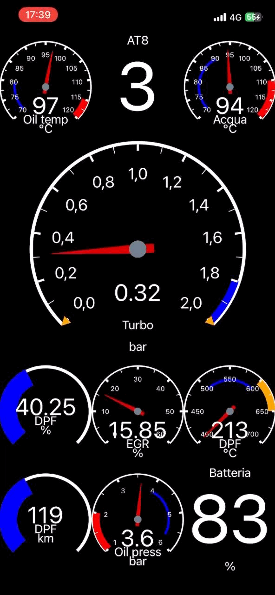

## Alfaromeo-Giulia-Stelvio-PIDs
# Alfaromeo Giulia-Stelvio PIDs and CarScanner export

This space have the purpose to share the parameters I've collected and experimented on my Alfaromeo Giulia 2.2mjtd MY2016. 
Some parameters are found around most famous alfa forums (mainly https://www.giuliaforums.com/ and https://www.alfaowner.com/ ), and the most part are from a personal reverse engineering long term project.

Here you can find a simple sheet with the list, and a direct import file for CarScanner app (the one I usually use).

  

# file description
### custompids.csp
This is the starndard export format from CarScanner app, you can import that directly in your phone and than use all the new sensors. 
You don't need (and you shouldn't) to edit the file. 
It come out from my phone, and I had edited just to erease my working parameters that at the moment are not ready. It can be happen that something go wrong, if the import process report an error please tell me asap.

### custompids.csv
It's a human readable version of same datas as before. Just imported on a sheet, and cleaned from unuseful information. 
You can use that to import in your app or application, I'll try to have the same format in each upgrade. 
The columns of the sheet are:
1. Long description: any question? :)
2. Short description: it's the label attached on sensors on dashboard of the app, you probably don't need about this
3. Header: in short words it select the ecu you want to use for the request. The app have to send it before the command ID
4. Command ID (PID): it's the code of the parameter you are requesting
5. Formula: this is a very important part, because it tell how to manage the data you receive. A, B, C, ...etc, represents each byte of the answer, and the formula define how to pull out the value of the sensor. Note that all the formulas you find here are compatible with CarScanner syntax.
6. Measure unit: any questione here? ;)
7. Max value: it's not the maximum value you can expect, but in the way I've used it on the app it's the max value of the gauge you'll see on the screen. So bigger values can be displayed (as value) but the gauge will stay at the top. The meaning of this use is to see the gauge in the range you expect to see the sensor, and higher value may be the symptom of a problem
8. Min value: as for the max value but in the opposite way :)

## BACCABLE interaction
Some interesting datas are available only on direct can access. 
To overtake this limitation of ELM32, I use BACCABLE project of my dear friend gaucho 
https://github.com/gaucho1978/BACCAble 
He has defined a special unused header "DABAF1" as the address for his board (a cheap canable you can easly find), and with special string construction we can now find unaccessible datas through BACCABLE. 
You find those "sensor" as "BACCABLE" in long description. 

### ATTENTION!!
If you have a baccable installed with immobilizer function actived, don't use tire's pids that have header DAC7F1: it will engadge the immobilizer and will stop the car!!!

# advice
Those parameters are tested on my diesel version of Giulia, so maybe that some of that are not applicable and not working on 2.0L and 2.9L. In the other hand some parameter found on forums are for petrol version and not working on mine, so they are not tested from me.

# my CarScanner setup
I use CarScanner for iphone https://apps.apple.com/it/app/car-scanner-elm-obd2/id1259933623 that have a nice hmi and a good customization. On lastet version the developer had added many of my sensors by default, so for standard use probably you don't need any more. But if you want to use custom sensor you need to buy the pro version (I found that the for life version is the best). 
To connect to my car I use a iCarPro in bt4.0 version. It work nice, and it's compact. 
You don't need any more thing.

### suggestions about how to arrange your dashboard
At the start I had spent some time with Stanislav (CarScanner) to have the app in working condition. So I share some trick that can help you to have a better use of the app :) 
I notice that in my car (that is a MY2016, so in other versions it may be different) the answer to DA10F1 header require some times. It mean that if you insert in the same screen of dashboard a DA10F1 sensor whit any other one, the DA10F1 will not appear because it doesn't have the time to answer. 
So my suggestion is to arrange sensors in dashboard pages so that all DA10F1 snsor are together and separathe from others. 
When you ar in a dashboard, only his sensor are queried so we use this characteristic.

In the same time you should manage the refresh rate of each sensor in your dashboard. For example if you have in the same screen the turbo pressure and a temperature, you can assign to turbo sensor (that move quickly) a higher priority that the temperature (that is always slow). To do that you can change "priority" field in the sensor property. For example if you set "1" it is required at each screen refresh loop, if you set "1/50" that sensor is required one time each 50. The priority field is a property of the sensor adn is applied in each screen it is used. 
For the most of sensors I've setted the priority I feel right, so probably you don't need to change it.

# contacts
I can accept requests for new parameters: if is possible I can insert those in my list for reverse engineering. 
Tell me if you find some error on my files, I can only appreciate your feedback. 
Don't ask me in direct message how to use your device, your app, and your obd2 adapter: probably I can't help you, use internet to fine other experiences. Here you can find some faq about the app I use https://www.carscanner.info/ 
That's my profile https://www.giuliaforums.com/members/danardi.37372/ feel free to contact me.

# disclaimer
No affiliate link here, all the sources are only to help you. Choose what you prefer.

You are going to see parameters that the engineers that built your car was sure that you don't need. Be sure to know what you are reading before to warry about it.
