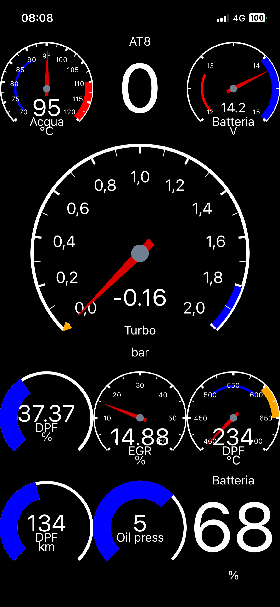

## Alfaromeo-Giulia-Stelvio-PIDs
# Alfaromeo Giulia-Stelvio PIDs and CarScanner export

This space have the purpose to share the parameters I've collected and experimented on my Alfaromeo Giulia 2.2mjtd MY2016.
Some parameters are found around most famous alfa forums (mainly https://www.giuliaforums.com/ and https://www.alfaowner.com/ ), and the most part are from a personal reverse engineering long term project.

Here you can find a simple sheet with the list, and a direct import file for CarScanner app (the one I usually use).

  

# advice
Those parameters are tested on my diesel version of Giulia, so maybe that some of that are not applicable and not working on 2.0L and 2.9L. In the other hand some parameter found on forums are for petrol version and not working on mine, so they are not tested from me.

# my CarScanner setup
I use Carscanner for iphone https://apps.apple.com/it/app/car-scanner-elm-obd2/id1259933623 that have a nice hmi and a good customization. On lastet version the developer had added many of my sensors by default, so for standard use probably you don't need any more. But if you want to use custom sensor you need to buy the pro version (I found that the for life version is the best).
To connect to my car I use a iCarPro in bt4.0 version. It work nice, and it's compact.
You don't need any more thing.

## suggestions
I notice that in my car (that is a MY2016, so in other versions it may be different) the answer to DA10F1 header require some times. It mean that if you insert in the same screen of dashboard a DA10F1 sensor whit any other one, the DA10F1 will not appear because it doesn't have the time to answer.
So my suggestion is to arrange sensors in dashboard pages so that all DA10F1 snsor are together and separathe from others.

# contacts
I can accept requests for new parameters: if is possible I can insert those in my list for reverse engineering.
Tell me if you find some error on my files, I can only appreciate your feedback.
Don't ask me in direct message how to use your device, your app, and your obd2 adapter: probably I can't help you.
That's my profile https://www.giuliaforums.com/members/danardi.37372/ feel free to contact me.

# Disclaimer
No affiliate link here, all the sources are only to help you. Choose what you prefer.
